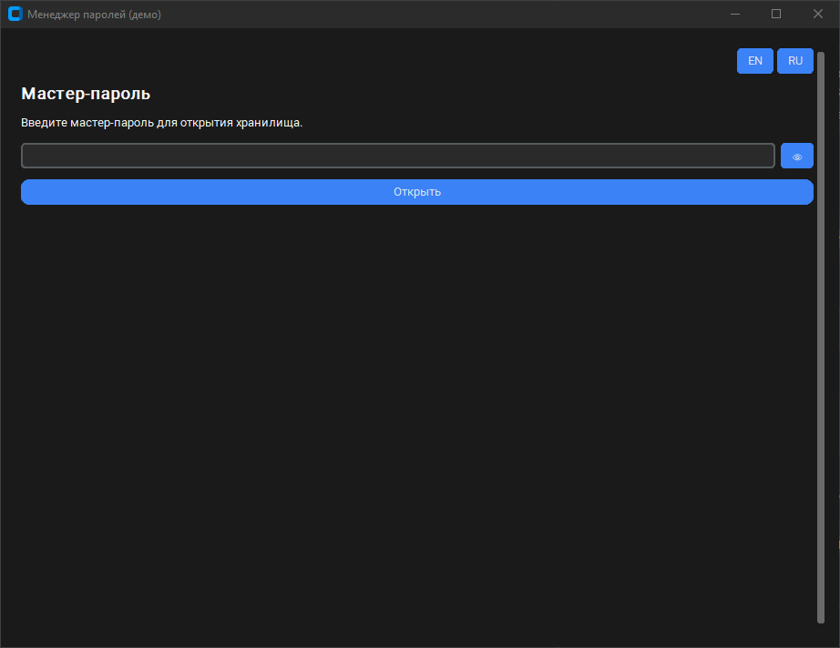
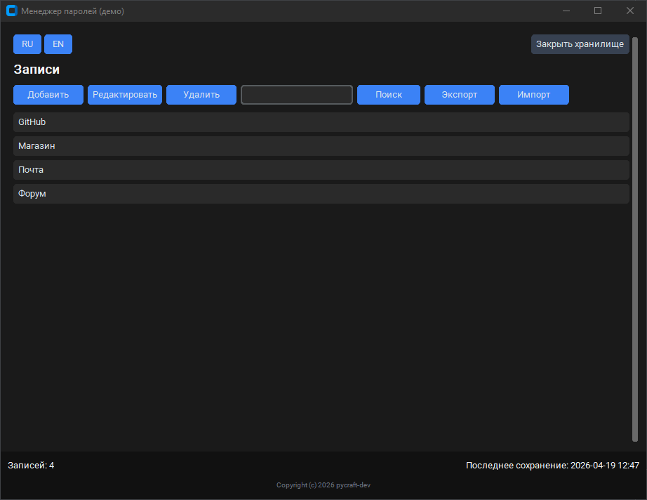
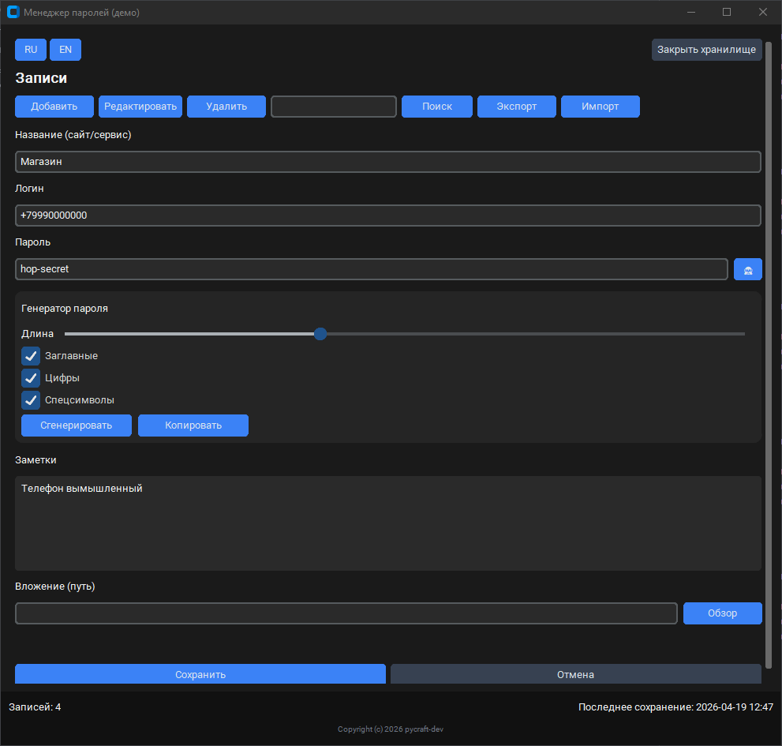

# Локальный менеджер паролей (демо)

Десктопное приложение на **CustomTkinter** с шифрованием **AES-256-GCM**, хранением в **SQLite** и экспортом/импортом зашифрованного **JSON**. Подходит для демонстрации на Kwork: один экран, тёмная тема, генератор паролей, локализация **RU/EN**.

## Скриншоты / демо

Файлы лежат в [docs/screenshots/](docs/screenshots/).

### Экран мастер-пароля



### Список записей



### Форма записи и генератор



<details>
<summary>English version</summary>

# Local password manager (demo)

A **CustomTkinter** desktop app with **AES-256-GCM** encryption, **SQLite** storage, and encrypted **JSON** export/import. Single-window UI, dark theme, password generator, **RU/EN** localization.

## Screenshots / demo


</details>

## Установка и запуск

1. Python **3.11+** (рекомендуется; проверено на 3.14 в среде разработки).
2. Клонируйте репозиторий и перейдите в каталог проекта.
3. Создайте виртуальное окружение и установите зависимости:

```bash
python -m venv .venv
.venv\Scripts\activate
pip install -r requirements.txt
```

4. Скопируйте `.env.example` в `.env` и при необходимости измените пути:

```bash
copy .env.example .env
```

5. Запуск из корня проекта:

```bash
python main.py
```

### Сборка EXE (Windows)

```bash
pip install pyinstaller
pyinstaller build_exe.spec --noconfirm
```

Готовый файл: `dist/PasswordManagerDemo.exe`. Иконка и `translations.json` включаются через секцию `datas` в [build_exe.spec](build_exe.spec).

### Релиз (архив для клиента)

Текущая версия задаётся в [VERSION](VERSION), история изменений — в [CHANGELOG.md](CHANGELOG.md). Номер версии отображается в заголовке окна (`v…`).

Сборка EXE и ZIP с `LICENSE`, `README_КЛИЕНТУ.md`, `.env.example` и `CHANGELOG.md`:

```powershell
.\scripts\make_release.ps1
```

Архив появится в `release/PasswordManagerDemo-<версия>-win64.zip`. Папка **`release/`** не коммитится в Git (см. `.gitignore`) — ZIP загружайте вручную в [GitHub Releases](https://docs.github.com/repositories/releasing-projects-on-github/about-releases) или отдельно клиенту.

### Публикация на GitHub

1. Создайте пустой репозиторий на GitHub (без README, если уже есть локальный).
2. В корне проекта: `git init`, затем `git add .` и `git commit -m "Initial commit"`.
3. Подключите remote и выполните `git push -u origin main` (или `master`).
4. В релиз на GitHub прикрепите архив из `release/`, собранный скриптом `make_release.ps1` — сам архив в репозиторий не кладётся.

В репозиторий не попадают: `dist/`, `build/`, `release/`, `.env`, `*.log`, локальные `*.db`, виртуальное окружение (см. [.gitignore](.gitignore)).

## Документация

- **Инструкция для пользователя:** [README_КЛИЕНТУ.md](README_КЛИЕНТУ.md)  
- **Тестовые данные:** [test_data/README.md](test_data/README.md)  

### Безопасность (важно)

- Мастер-пароль **не хранится** на диске; из него выводится ключ **PBKDF2-HMAC-SHA256** (число итераций задаётся в `.env`, по умолчанию `390000`).
- Поля логина, пароля, заметок и пути вложения хранятся в SQLite в виде **зашифрованного blob** на запись. Название записи хранится **открытым текстом** для быстрого поиска (демо-ограничение).
- Экспорт — отдельный JSON, зашифрованный тем же мастер-паролем и **солью файла**; без пароля содержимое не прочитать.
- Демо не заменяет специализированные менеджеры паролей уровня продакшена; не храните реальные боевые секреты без отдельной оценки рисков.

### Автозапуск

Штатного автозапуска нет. Для автозапуска в Windows можно создать ярлык в папке «Автозагрузка» на `PasswordManagerDemo.exe`.

## Архитектура

```text
password_manager_task/
├── VERSION                 # номер релиза
├── main.py                 # точка входа, логирование
├── assets/                 # иконки
├── src/
│   ├── config/             # настройки и константы
│   ├── core/               # шифрование, БД, генератор, экспорт/импорт
│   ├── ui/                 # окна и компоненты
│   └── utils/              # пути, буфер обмена, i18n
├── test_data/              # примеры для ручных сценариев
├── tests/                  # pytest
└── translations.json       # строки RU/EN
```

Поток данных: мастер-пароль → PBKDF2 → ключ AES-GCM → шифрование полезной нагрузки каждой записи в SQLite.

## Лицензия

Проект распространяется по лицензии MIT: см. [LICENSE](LICENSE).

## Контакты разработчика

**Вова | pycraft-dev**  
Python-разработчик • Современные GUI-приложения • Автоматизация

- Электронная почта: [pycraft-dev@21051992.ru](mailto:pycraft-dev@21051992.ru)  
- Telegram: [@Pycraftdev](https://t.me/Pycraftdev)  
- Kwork: [kwork.ru/user/pycraft-dev](https://kwork.ru/user/pycraft-dev)  
- GitHub: [github.com/pycraft-dev](https://github.com/pycraft-dev)

> Нужно похожее приложение под ваши задачи? Напишите — обсудим.
